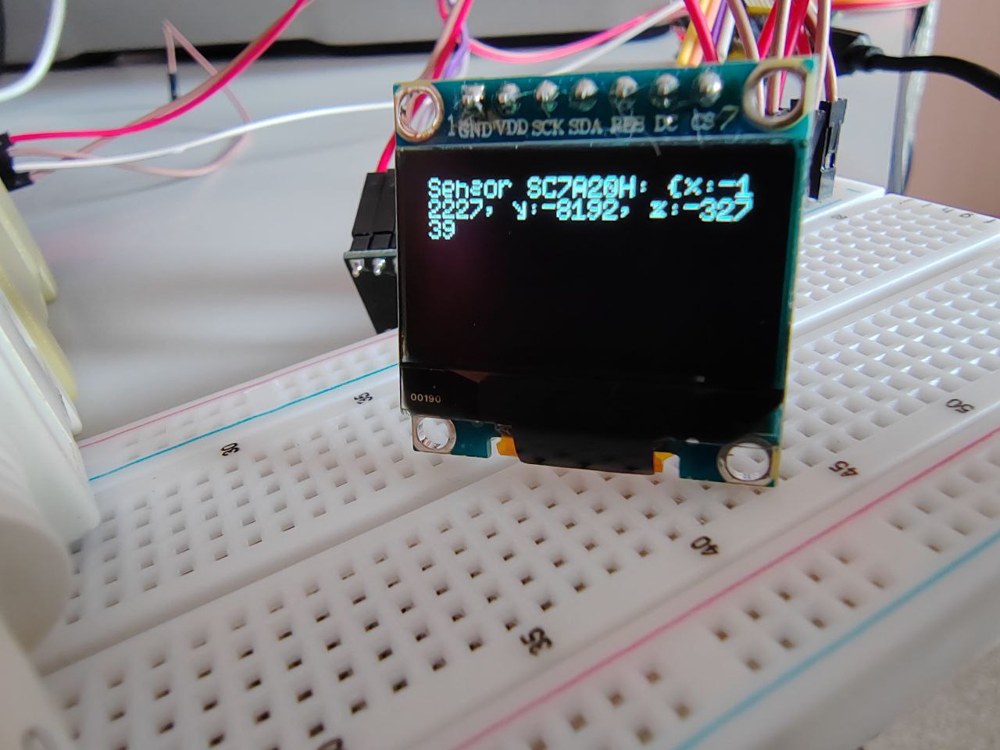
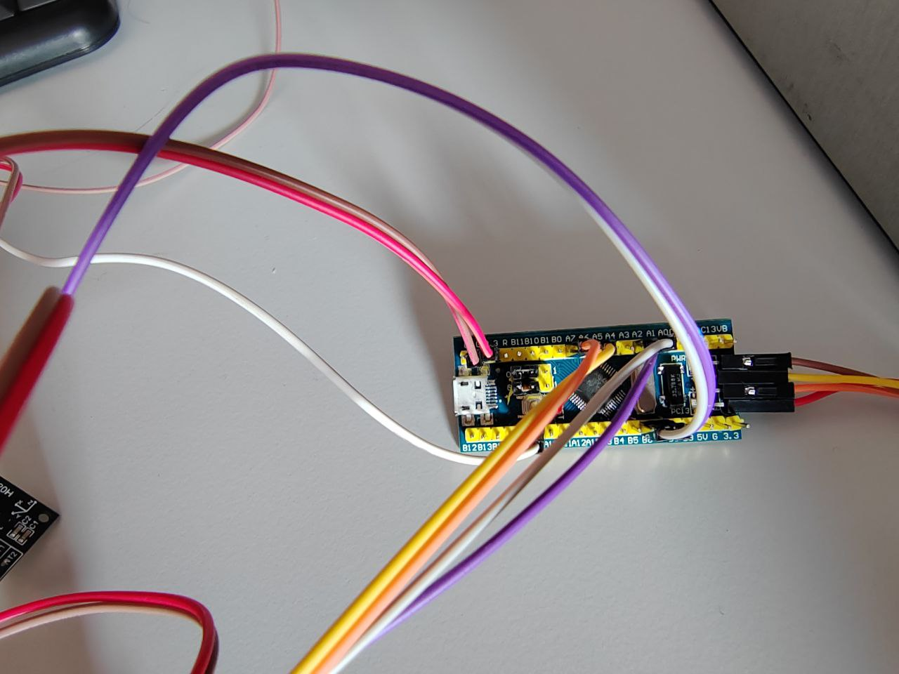
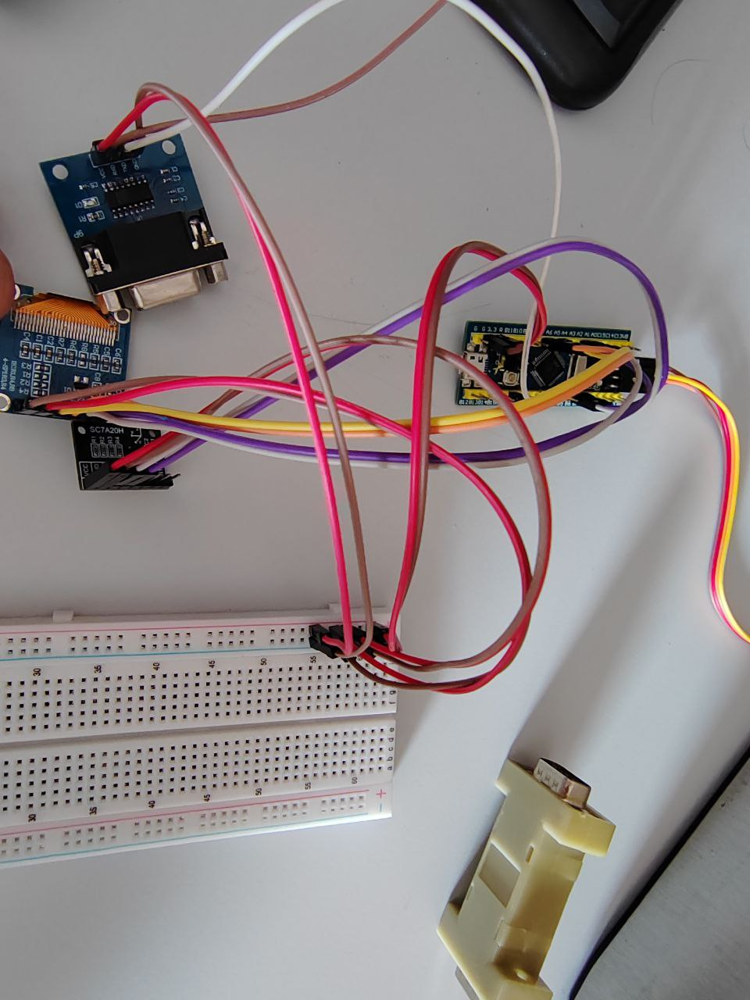

# Hi 👋, I'm Sergey Makarov


- 🔭 I’m currently working on [STM32-Graphics-Sensor](https://github.com/Sergey030520/STM32-Graphics-Sensor.git)  
- 👨‍💻 All of my projects are available at [https://github.com/Sergey030520](https://github.com/Sergey030520)

## Languages and Tools

 
 
 
 

# STM32 Graphics + Sensor

## Оглавление

1. [Описание](#description_project)  
2. [Функционал библиотеки](#features)  
3. [Драйверы](#drivers)  
4. [Сборка проекта](#build_project)  
5. [Выбор дисплея](#choose_display)  
6. [Структура проекта](#project_structure)  
7. [Примеры работы](#example_work_project)
   - [Основной цикл](#main_loop)
   - [Пример работы: датчик + OLED SSD1306](#example_sensor_oled)
   - [Рисование примитивов напрямую](#draw_primitives_direct)
   - [Рисование примитивов через библиотеку `graphics`](#draw_primitives_graphics)
   - [Пример рисования примитивов с функцией draw_pixel](#draw_primitives_with_draw_pixel)
9. [Загрузка на плату](#flash_to_board)

---

## Описание <a name="description_project"></a>

Проект реализует **графическую библиотеку для STM32F103** с поддержкой работы с дисплеями и датчиком ускорения.  
Основная цель — отрисовка примитивов и текста на экране в реальном времени с выводом данных с датчика **SC7A20H**.  

- По умолчанию используется **OLED SSD1306**, но можно выбрать **TFT ST7789**, определив макрос `TFT_DISPLAY` в `CMakeLists.txt`.  
- Взаимодействие с **датчиком SC7A20H** происходит через **I2C**.  
- Взаимодействие с **дисплеями SSD1306 и ST7789** — через **SPI**.  

В проекте также реализован универсальный слой **`gfx`** (в папке `middleware`), который связывает графическую библиотеку с драйверами дисплеев.  
Это позволяет писать код один раз, а использовать его с разными экранами без изменений.  
Также в `gfx` есть функция `gfx_test_display()`, которая выводит на дисплей тестовые примитивы и текст.  

---

## Основные возможности <a name="features"></a>

### Графическая библиотека
- Отрисовка текста.
- Примитивы: линия (алгоритм Брезенхема), прямоугольник, треугольник, круг.
- Работа с буфером дисплея.

### Система логирования
- UART логирование.
- Своя система логов с уровнями (`LOG_INFO`, `LOG_ERROR`, `LOG_DEBUG`, `LOG_WARNING`).

---

## Драйверы <a name="drivers"></a>

- **Дисплеи**:  
  - ST7789 (TFT)  
  - SSD1306 (OLED)  

- **Сенсоры**:  
  - SC7A20H (акселерометр)  

- **Периферия STM32F103**:  
  - GPIO, RCC  
  - SPI, I2C  
  - IRQ, DMA  
  - UART (логирование)  
  - TIM (таймеры) , PWM 
  - LED  

---

## Сборка проекта <a name="build_project"></a>

Проект поддерживает сборку с помощью **CMake**.  

Пример сборки на Linux:  
```bash
mkdir build
cd build
cmake ..
make
```
## Выбор дисплея <a name="choose_display"></a>

По умолчанию используется **OLED SSD1306**.  
Для использования **TFT ST7789** есть два способа:

#### 1. **Через командную строку при сборке**:  
```
cmake -DTFT_DISPLAY=ON ..
```

#### 2. **Прямо в `CMakeLists.txt`**:

Добавьте или раскомментируйте строку:  
```cmake
set(TFT_DISPLAY ON)
```

## Структура проекта <a name="project_structure"></a>

```text
├── src/                      # Основной код проекта (модули, функции, логика приложения)
├── drivers/
│   ├── core/                 # Основные драйверы STM32 (GPIO, RCC, TIM, UART и т.д.)
│   ├── devices/              # Драйверы устройств
│   │   ├── display-ST7789/   # SPI-драйвер и обертки для ST7789
│   │   ├── oled-SSD1306/     # SPI-драйвер и обертки для SSD1306
│   │   └── graphics/         # Обертки графики, примитивы
│   └── sensors/              # Драйверы сенсоров, например SC7A20H (I2C)
├── middleware/
│   ├── gfx.c                 # Универсальный слой отрисовки + gfx_test_display()
│   └── logger/               # Система логирования: обертки для UART + логирование
│       ├── logger.c          # Основной код логирования
│       └── logger.h          # Заголовочный файл
├── include/                  # Заголовочные файлы для всего проекта
├── docs/
│   └── stm32f103.md          # Документация по STM32F103
├── startup/
│   └── startup_stm32f103c8tx.s   # Стартовый файл
├── conf_mem_stm32f108/
│   └── STM32F103C8TX_FLASH.ld     # Линкерский скрипт
├── CMakeLists.txt            # Сборка проекта
```
### Дополнительно

В **middleware** и отдельных модулях находятся файлы инициализации и обертки для работы с периферией и устройствами:

- **tft_board.c/.h**  
  Настройка SPI для TFT-дисплея и создание оберток для обмена данными с драйвером дисплея.

- **oled_board.c/.h**  
  Настройка SPI для OLED-дисплея и создание оберток для обмена данными с драйвером дисплея.

- **usart_board.c/.h**  
  Инициализация UART и создание функции-обертки для логирования.

- **sensors.c/.h**  
  Инициализация I2C, обработчики датчиков и обертки для получения данных с сенсоров.  
  Позволяет в будущем добавлять несколько датчиков.

- **gfx.c**  
  Универсальный слой отрисовки, объединяющий вызовы графической библиотеки с конкретными дисплеями.  
  Содержит функцию `gfx_test_display()` для тестовой отрисовки примитивов и текста.

## Примеры работы <a name="example_work_project"></a>

### Основной цикл <a name="main_loop"></a>
- Опрашивает датчик **SC7A20H**.  
- Выводит данные на дисплей (по умолчанию — SSD1306).  

Пример вызова в `main.c`:
```c
int main()
{

    int status = init_board();
    if (status != 0)
    {
        ledOn(1);
        goto error;
    }

    LOG_INFO("Драйверы запущены\r\n");

    print_clock_frequencies();

    sensors_init();

    gfx_drv_init();

    Vector vector = {0};

    while (1)
    {
        status = get_data_sensor_sc7a20h(&vector);
        if (status != 0)
        {
            LOG_INFO("Error get data sensor: %d\r\n", status);
        }
        else
        {
            display_sensor_data(&vector);
            LOG_INFO("Sensor SC7A20H: {x:%d,y:%d,z:%d}\r\n", vector.X, vector.Y, vector.Z); 
        }
        delay_timer(5000);
    }

error:
    while (1)
        ;

    return 0;
}
```

### Пример работы: датчик + OLED SSD1306 <a name="example_sensor_oled"></a>

В этом примере данные с датчика **SC7A20H** выводятся на дисплей **SSD1306** и логируются через UART (по умолчанию 9600 бод).  

#### Фото дисплея

  
*На фото показаны текущие значения акселерометра SC7A20H на дисплее.*

#### Фото платы с подключением датчика

  
*Вид сверху на STM32F103 с проводами, подключенными к датчику SC7A20H и OLED SSD1306.*

  
*Вид сверху всей сборки с подключённым датчиком и дисплеем.*

#### Логи UART

```
[main.c:35] Драйверы запущены
[main.c:151] SYSCLK: 72000000 Hz
[main.c:152] HCLK  : 72000000 Hz
[main.c:153] APB1  : 36000000 Hz
[main.c:154] APB2  : 72000000 Hz
[main.c:155] USB  : 48000000 Hz
[main.c:156] ADC  : 12000000 Hz
[main.c:157] source: 2
[main.c:55] Sensor SC7A20H: {x:8235,y:16598,z:-4066}
[main.c:55] Sensor SC7A20H: {x:28714,y:-16171,z:-12258}
[main.c:55] Sensor SC7A20H: {x:-8150,y:-16171,z:-20449}
[main.c:55] Sensor SC7A20H: {x:24619,y:-24363,z:-4066}
[main.c:55] Sensor SC7A20H: {x:28715,y:16597,z:-20449}
```

### Рисование примитивов напрямую <a name="draw_primitives_direct"></a>

```c
gfx_drv_fill((Point){0, 0}, (Point){disp.width - 1, disp.height - 1});
gfx_drv_draw_line((Point){0, 0}, (Point){disp.width - 1, disp.height - 1});
gfx_drv_draw_line((Point){0, disp.height - 1}, (Point){disp.width - 1, 0});
gfx_drv_draw_rect((Point){10, 10}, (Point){50, 30});
gfx_drv_draw_triangle((Point){60, 20}, (Point){90, 50}, (Point){40, 50});
gfx_drv_draw_circle((Point){disp.width/2, disp.height/2}, 20);
gfx_drv_draw_string(0, 0, "Test");
gfx_drv_fill((Point){5, 5}, (Point){15, 15});
```
### Рисование примитивов через библиотеку `graphics` <a name="draw_primitives_graphics"></a>

Для работы всех функций используется структура дисплея:

```c
typedef struct {
    void (*draw_pixel)(uint16_t x, uint16_t y, GFX_Color color);
    uint16_t width;
    uint16_t height;
} GFX_Display_t;
```
### Пример рисования примитивов (через библиотеку `graphics` с собственной функцией draw_pixel) <a name="draw_primitives_with_draw_pixel"></a>

> Пример показывает, как рисовать линии, прямоугольники, круги, треугольники и текст напрямую через библиотеку `graphics`, используя структуру `GFX_Display_t`, где вы сами задаёте функцию отрисовки пикселя (`draw_pixel`), размеры дисплея и текущие цвета.

```
// Инициализация дисплея
GFX_Display_t disp;
disp.width = SSD1306_WIDTH;
disp.height = SSD1306_HEIGHT;
disp.draw_pixel = gfx_draw_pixel_gfx;

// Инициализация текущих цветов
static GFX_Color current_color = {.value = 1};
static GFX_Color current_bg_color = {.value = 0};

// Инициализация текущего шрифта
GFX_Font_t *current_font = &font5x7_struct;
gfx_set_font(current_font);

// Рисование примитивов
gfx_draw_line(&disp, (Point){0,0}, (Point){50,50}, current_color);
gfx_draw_rect(&disp, (Point){10,10}, (Point){40,20}, current_color);
gfx_draw_circle(&disp, (Point){64,32}, 15, current_color);
gfx_draw_triangle(&disp, (Point){20,20}, (Point){40,20}, (Point){30,40}, current_color);

// Рисование текста
gfx_draw_char(&disp, 5, 5, 'A', current_color, current_bg_color);
gfx_draw_string(&disp, 10, 10, "Hello GFX", current_color, current_bg_color);

// Заполнение области
gfx_fill(&disp, (Point){0,0}, (Point){disp.width-1, disp.height-1}, current_bg_color);

```

## Загрузка на плату <a name="flash_to_board"></a>

На Linux перед загрузкой прошивки необходимо установить утилиту `st-flash`:

```
sudo apt install stlink-tools
```

Для загрузки прошивки на STM используется скрипт load_stm_data.sh с утилитой st-flash:
```
./load_stm_data.sh
```
